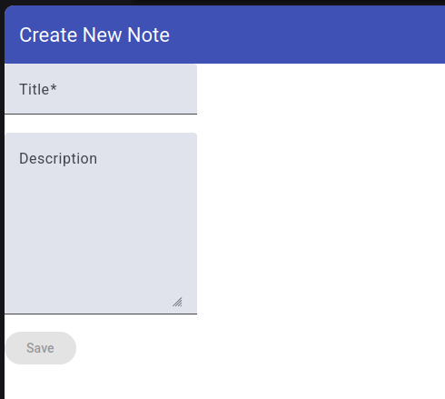
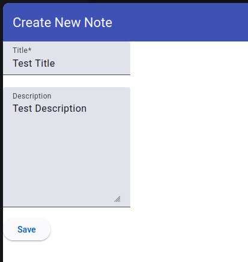
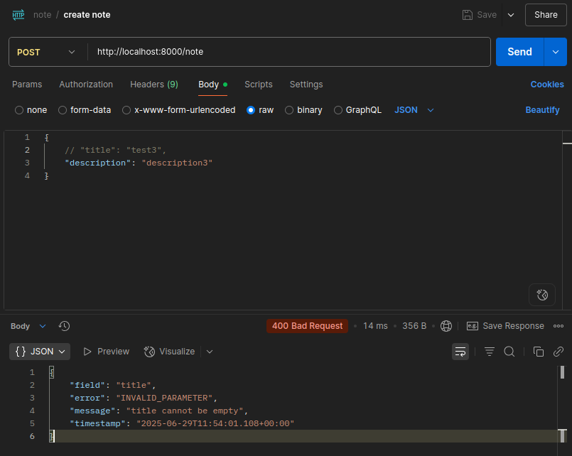
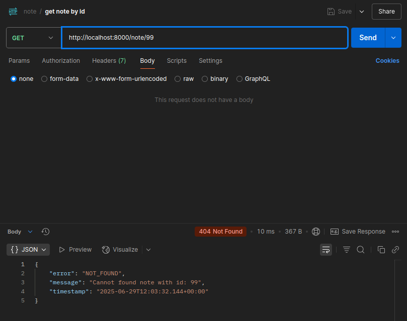
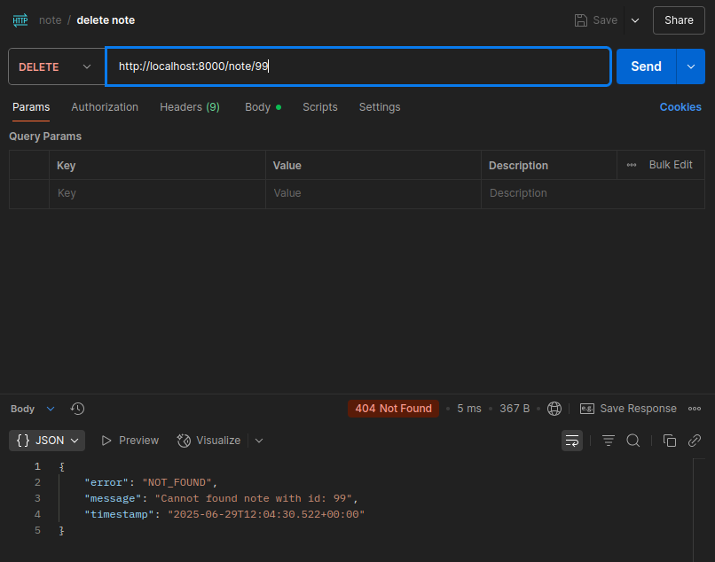
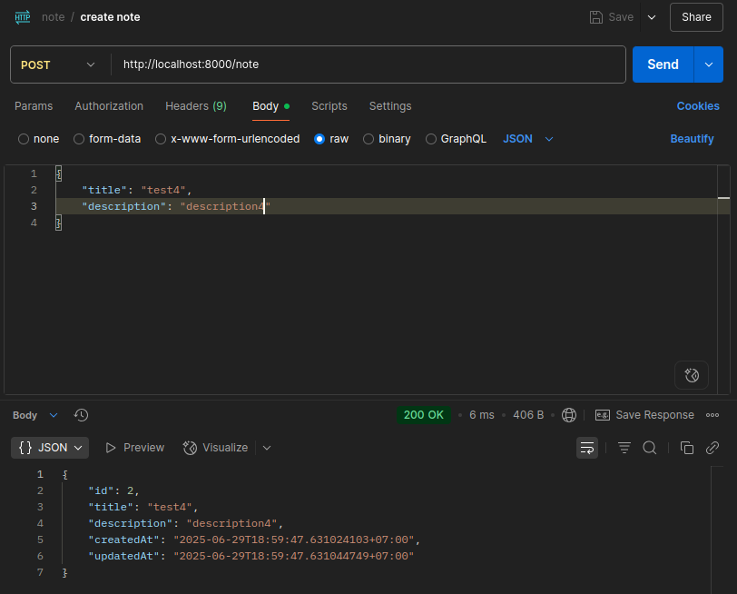
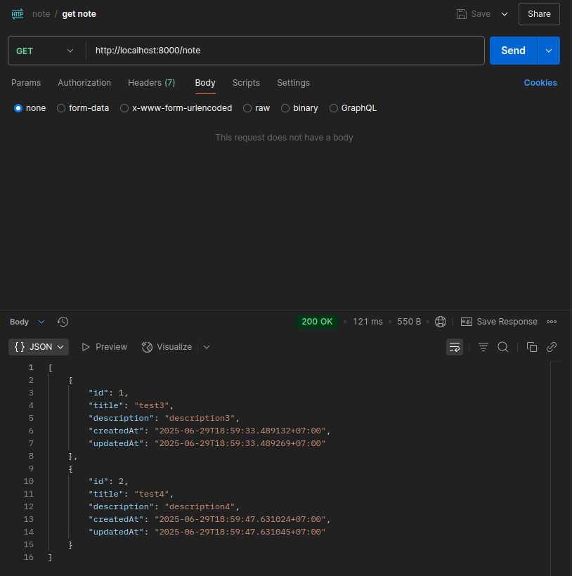
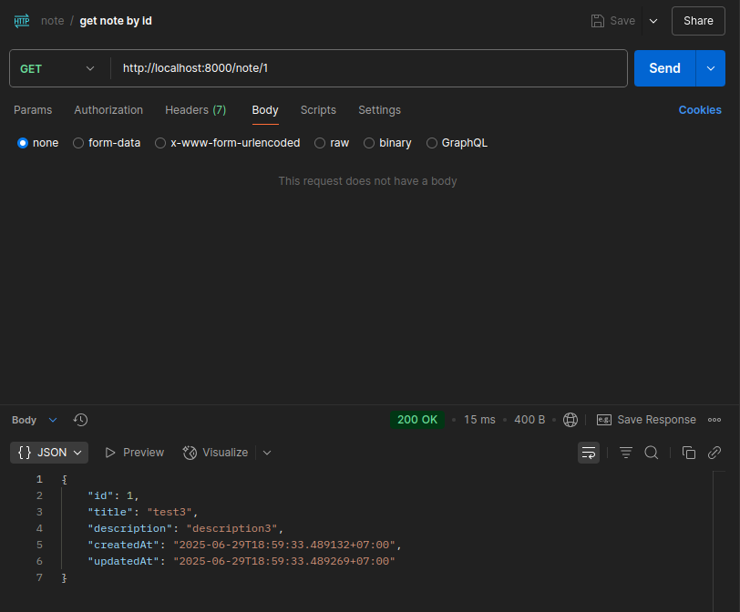
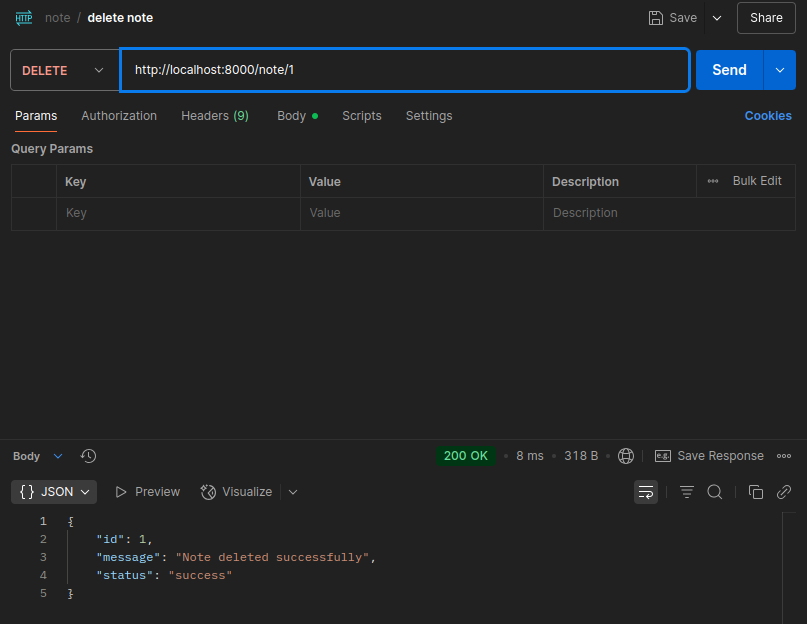
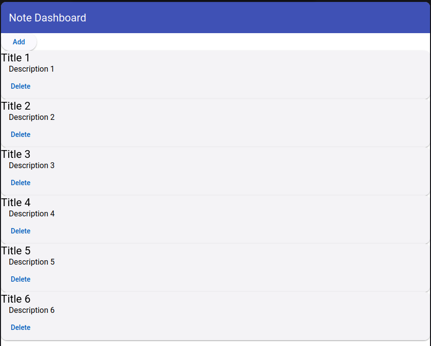

## Prerequisites

- Java 17+
  

## How to Run

1. **Build the project**:

```bash
mvn clean install
```
2. **Run the project**:

```bash
mvn spring-boot:run
```

3. **Access the API**:

```bash
[GET][POST][DELETE] [LABEL](http://localhost:8000/note)
```
4. **Front-End Demo**

https://github.com/PramudiaPutra/astrapay-angular-external

## Screenshot
**Validation**
<br>
[Empty Title]
<br>

<br>
[Filled Title]
<br>

<br>
[API Empty or Null Field]
<br>

<br>
[Get Id Not Found]
<br>

<br>
[Delete Id Not Found]
<br>

<br>
<br>
**Postman**
<br>
[Create Note]
<br>

<br>
[Get All Note]
<br>

<br>
[Get Note by Id]
<br>

<br>
[Delete Note by Id]
<br>

<br>
<br>
**Front End**
<br>
[Empty Note]
<br>

<br>
[Insert 6 Note]
<br>

